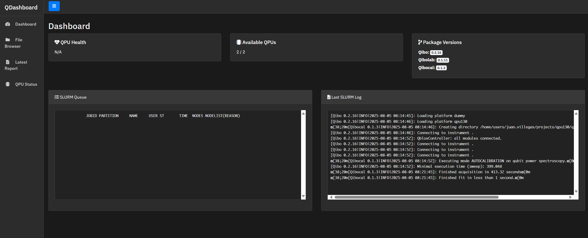

# QDashboard

A professional quantum computing dashboard with file browsing, experiment monitoring, QPU status tracking, and report visualization capabilities.



## About

QDashboard is a comprehensive web-based dashboard designed for quantum computing environments. It provides real-time monitoring, file management, and experiment tracking capabilities for quantum computing workflows. 
The file server functionality is based on the [flask-file-server](https://github.com/Wildog/flask-file-server) project by Wildog.

## Features

- **Dashboard**: Real-time QPU health monitoring, job queue status, and package version tracking
- **File Browser**: Elegant file browsing and management interface (based on flask-file-server)
- **Report Viewer**: Advanced rendering of quantum experiment reports with Plotly support and dark theme
- **QPU Status**: Live monitoring of quantum processing unit availability and SLURM queue integration
- **Job Submission**: SLURM job submission and monitoring interface
- **Package Monitoring**: Real-time display of installed qibo, qibolab, and qibocal versions

## Quick Start

### Development Server
```bash
python quantum_dashboard.py
```

### Using the Startup Script
```bash
./start_qdashboard.sh
```

### Docker Build
```bash
docker build --rm -t qdashboard:latest .
```

### Docker Run
```bash
docker run -p 5005:5005 qdashboard
```

## Configuration

Environment variables:

- `QD_BIND` - Bind address, default 127.0.0.1
- `QD_PORT` - Server port, default 5005  
- `QD_PATH` - Root path to serve, default $HOME
- `QD_KEY` - Authentication key (base64 encoded username:password), default none
- `QIBOLAB_PLATFORMS` - Path to qibolab platforms directory

### Example with custom configuration:
```bash
docker run -p 8000:8000 -e QD_BIND=0.0.0.0 -e QD_PORT=8000 -e QD_PATH=/data -e QD_KEY=dGVzdDp0ZXN0 qdashboard
```

## Dependencies

- Flask >= 3.0.0
- humanize >= 4.0.0
- pathlib2 >= 2.3.0
- werkzeug >= 3.0.0
- PyYAML >= 6.0.0

## Architecture

QDashboard extends the file server capabilities with quantum computing specific features:

- **Quantum Package Integration**: Automatic detection and monitoring of qibo ecosystem packages
- **SLURM Integration**: Real-time queue monitoring and job submission capabilities
- **Report Rendering**: Enhanced HTML report rendering with Plotly support and dark theme compatibility
- **QPU Management**: Platform configuration parsing and status monitoring

## Acknowledgments

- File server functionality based on [flask-file-server](https://github.com/Wildog/flask-file-server) by [Wildog](https://github.com/Wildog)
- Dark theme inspired by IBM Quantum Computing platform
- Built for quantum computing workflows using the qibo ecosystem

## License

This project extends the original flask-file-server codebase with quantum computing specific enhancements.

