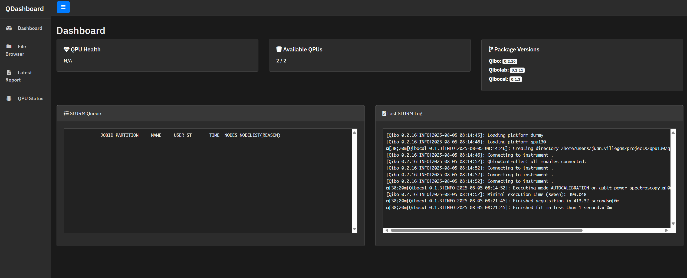

# QDashboard

A web dashboard for quantum computing workflows built on the [Qibo](https://github.com/qiboteam/qibo) stack. QDashboard provides a unified interface for browsing experiment data, monitoring QPU health and SLURM job queues, submitting calibration experiments, managing qibolab platform repositories, and viewing qibocal reports.



---

## Features

| Area | Capabilities |
|---|---|
| **Dashboard** | Live QPU health, SLURM queue overview, package version tracking |
| **Experiment Builder** | Browse qibocal protocols, configure parameters, generate YAML runcards, submit to SLURM |
| **QPU Management** | Platform Git repository management (branch switching, commits, stashes, push), topology visualisation |
| **File Browser** | Navigate the experiment data directory, view and download files |
| **Report Viewer** | Render qibocal HTML reports with dark-theme asset rewriting |
| **REST API** | OAS 3.1-compliant JSON API — interactive docs at `/docs` (Swagger UI) and `/redoc` |

---

## Requirements

- Python ≥ 3.10
- [uv](https://docs.astral.sh/uv/) (recommended) or pip

Optional but recommended:

- `qibo ≥ 0.3.3` — quantum simulation and gate library
- `qibolab ≥ 0.2.15` — hardware control layer
- `qibocal ≥ 0.2.5` — calibration protocol suite
- `qibolab-qblox ≥ 0.0.4` — Qblox hardware driver
- `qibolab-qm ≥ 0.0.1` — Quantum Machines hardware driver

---

## Installation

### From PyPI (not yet suppoorted)

```bash
uv venv
source .venv/bin/activate
uv pip install qdashboard
```

For hardware-specific extras:

```bash
# Qblox instruments
uv pip install "qdashboard[quantum,qblox]"

# Quantum Machines
uv pip install "qdashboard[quantum,qm]"

# All hardware + dev tools
uv pip install "qdashboard[all]"
```

### From Source (Development)

```bash
git clone https://github.com/qiboteam/qdashboard.git
cd qdashboard

uv venv
source .venv/bin/activate          # Windows: .venv\Scripts\activate

# Minimal install
uv pip install -e .

# With quantum stack
uv pip install -e ".[quantum]"

# With a specific hardware backend
uv pip install -e ".[quantum,qblox]"
uv pip install -e ".[quantum,qm]"

# Everything (quantum + all dev/test/docs tools)
uv pip install -e ".[all]"
```

---

## Quick Start

```bash
# Default: http://127.0.0.1:5005
qdashboard

# Custom host and port
qdashboard --host 0.0.0.0 --port 8080

# Custom data root + debug mode (full stack traces in error responses)
qdashboard --root ~/.qdashboard --debug

# With authentication
qdashboard --auth-key mysecretkey
```

---

## Configuration

Settings are resolved in priority order:  
**CLI args › shell environment variables › `.env` file › built-in defaults**

### `.env` File

On startup QDashboard looks for a `.env` file first in the current working directory, then in `~/.qdashboard/.env`. Copy the example and edit it:

```bash
cp .env.example .env   # or ~/.qdashboard/.env
```

### Environment Variables

| Variable | CLI equivalent | Default | Description |
|---|---|---|---|
| `QD_ROOT` | `--root` | `~/.qdashboard` | Root directory for logs, temp files, and the platforms repo |
| `QD_DATA_DIR` | — | `$QD_ROOT/data` | Directory served by the file browser and used to store experiment results |
| `QD_HOST` | `--host` | `127.0.0.1` | Bind address |
| `QD_PORT` | `--port` | `5005` | Listen port |
| `QD_KEY` | `--auth-key` | *(none)* | Authentication key — if set, every request must include `X-Auth-Key: <key>` header or `?key=<key>` query parameter (including `/docs`) |
| `QD_DEBUG` | `--debug` | `false` | Enable debug mode — full tracebacks in JSON error responses and styled HTML error pages |
| `QD_LOG_PATH` | — | `$QD_ROOT/logs` | Log file directory |
| `QD_ENVIRONMENT` | — | *(none)* | Deployment environment label passed to experiment submissions |
| `QIBOLAB_PLATFORMS` | — | `$QD_ROOT/qibolab_platforms_qrc` | Path to the qibolab platforms repository |

### CLI Reference

```
qdashboard [--host HOST] [--port PORT] [--root ROOT]
           [--auth-key KEY] [--debug] [--version]
```

---

## Directory Layout

```
~/.qdashboard/
├── data/                        # Experiment results (QD_DATA_DIR)
│   └── <platform>/
│       └── <YYYYMMDD>/
│           └── <YYYYmmDD-xxxxxx>/   # Experiment ID (date + 6-char hash)
│               ├── runcard.yml
│               ├── meta.json
│               └── ...
├── logs/                        # Server logs
├── temp/                        # Temporary files
└── qibolab_platforms_qrc/       # Platforms Git repository (QIBOLAB_PLATFORMS)
```

---

## QPU Platforms Management

QDashboard manages the qibolab platforms Git repository automatically:

1. Checks the `QIBOLAB_PLATFORMS` environment variable.
2. Falls back to `~/.qdashboard/qibolab_platforms_qrc` (auto-cloned on first run).

Use the dedicated CLI for manual operations:

```bash
qdashboard-platforms status              # Current branch and commit
qdashboard-platforms setup               # (Re-)clone the platforms repository
qdashboard-platforms update              # Pull latest changes
qdashboard-platforms branches            # List all branches
qdashboard-platforms switch <branch>     # Switch to a branch
qdashboard-platforms switch <branch> --create   # Create and switch
```

---

## REST API

The full API is documented interactively at:

- **Swagger UI** — `http://localhost:5005/docs`
- **ReDoc** — `http://localhost:5005/redoc`
- **Raw schema** — `http://localhost:5005/openapi.json`

The schema conforms to **OpenAPI 3.1.0**. When an auth key is configured the documentation endpoints are protected by the same key.

### Endpoint Groups

| Tag | Prefix | Summary |
|---|---|---|
| **SLURM** | `/cancel_job`, `/api/slurm_*` | Queue snapshot, SSE live stream, job cancellation |
| **Platforms** | `/api/platforms/*` | Branch listing, switching, commits, stashes, push |
| **QPU** | `/api/qpu_*` | Parameters, topology image, qubit list, calibration data |
| **Protocols** | `/api/protocols*` | Protocol discovery and parameter schemas |
| **Experiments** | `/api/experiments*`, `/submit_*`, `/repeat_*`, `/qibocal/*` | Submission, status tracking, qibocal CLI actions |

---

## Docker

```bash
docker build -t qdashboard .

docker run -p 5005:5005 \
  -e QD_HOST=0.0.0.0 \
  -e QD_PORT=5005 \
  -e QD_DATA_DIR=/data \
  -e QIBOLAB_PLATFORMS=/platforms \
  -v /your/data:/data \
  -v /your/platforms:/platforms \
  qdashboard
```

---

## Development

```bash
# Lint & format
black qdashboard/
flake8 qdashboard/

# Type check
mypy qdashboard/

# Tests
pytest qdashboard/tests/

# Start with live reload
qdashboard --debug
```

---

## Architecture

```
qdashboard/
├── core/           # FastAPI app factory (app.py) + centralised config (config.py)
├── web/            # All HTTP endpoints (routes.py), file browser, report viewer
├── qpu/            # QPU health/monitoring, SLURM queue, platform git ops, topology
├── experiments/    # Qibocal protocol discovery, job submission, runcard generation
├── utils/          # Formatters, logger
├── templates/      # Jinja2 HTML templates (Bootstrap 4 dark theme)
└── assets/         # Static CSS/JS served at /assets/
```

- **ASGI stack**: FastAPI ≥ 0.111 + Uvicorn ≥ 0.29
- **Templates**: server-side rendering via Jinja2 with Bootstrap 4
- **SSE streaming**: live SLURM queue updates via `StreamingResponse`
- **Debug mode**: structured JSON error responses with full tracebacks; dark-theme HTML error pages
- **OAS 3.1**: OpenAPI 3.1.0 schema with auth-guarded Swagger UI and ReDoc

---

## Acknowledgements

- File browser inspired by [flask-file-server](https://github.com/Wildog/flask-file-server) by [Wildog](https://github.com/Wildog), rewritten for ASGI.
- Dark theme inspired by the IBM Quantum Computing platform.
- Built for quantum computing workflows using the [Qibo](https://qibo.science) ecosystem.
